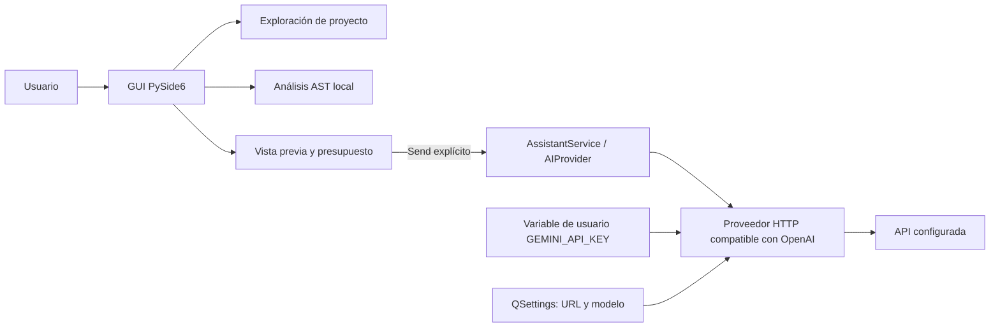

# Arquitectura

## Objetivo

Local CP explora y analiza proyectos localmente. La asistencia de IA es optativa:
el usuario selecciona un archivo, revisa el contexto y pulsa **Send** para enviarlo.
Abrir un proyecto o ejecutar análisis estático no inicia solicitudes externas.

## Componentes

- `gui`: interfaz PySide6, selección, vista previa y tareas en `QThreadPool`.
- `project`: exploración, clasificación y lectura de archivos de texto.
- `analysis`: análisis determinista de Python mediante `ast`.
- `ai.context`: alcance de un archivo y límite de entrada.
- `ai.provider`: contrato `AIProvider` consumible por otros proveedores.
- `ai.service`: construye el proveedor seleccionado y resuelve la credencial.
- `ai.openai_compatible`: transporte HTTP de Chat Completions.
- `config`: preferencias no secretas y lectura de `GEMINI_API_KEY` desde Windows.

El diagrama representa el flujo actual y es la base para próximas iteraciones.
`project`, `analysis` y `ai` no dependen de Qt. El modelo y la URL son campos
editables; el transporte puede reemplazarse implementando `AIProvider`.

## Alcance y límites del prototipo de IA

- Un archivo `.py` del proyecto abierto por solicitud; enlaces simbólicos y archivos
  externos al proyecto se rechazan.
- Máximo 12.000 bytes de fuente, 1.000 caracteres de pregunta y estimación de
  4.000 tokens de entrada. La estimación usa bytes UTF-8 divididos por 3 más margen;
  no es un tokenizador exacto.
- Máximo 384 tokens de salida solicitados al proveedor.
- El archivo se lee al preparar la vista previa y se conserva esa copia para el envío.
  Cambiar archivo o pregunta invalida la vista previa.
- La clave se lee en tiempo de ejecución del entorno del proceso o de la variable
  de usuario de Windows. No se guarda en `QSettings` ni en el repositorio.
- Errores HTTP muestran sólo código y categoría; no imprimen cuerpos de respuesta,
  encabezados, solicitudes ni claves.
- Una solicitud a la vez desde la pestaña AI. No hay reintentos automáticos.

## Concurrencia

Escaneo y análisis AST usan `QThreadPool`; la solicitud HTTP también. Los resultados
vuelven a la interfaz por señales Qt, conservando la ventana interactiva.

## Decisiones y límites conocidos

- El análisis estructural sigue siendo exclusivo de Python.
- La detección de lenguajes depende de extensiones.
- La vista de código no edita ni colorea sintaxis.
- Los directorios ignorados usan una lista fija, no `.gitignore`.
- No existe todavía un ejecutable empaquetado para Windows.
- La estimación de tokens es aproximada y la cuota real depende del proyecto de
  Google AI Studio. No se infiere una cuota gratis fija.
- El endpoint compatible con OpenAI está en beta según [Google AI for Developers](https://ai.google.dev/gemini-api/docs/openai).

## Evolución prevista

Ver [SPEC.md](SPEC.md). La próxima iteración puede sumar selección de varios archivos
con presupuesto agregado, detección de secretos, conteo más preciso por proveedor,
conversaciones locales y otros transportes sin tocar el análisis estático.
