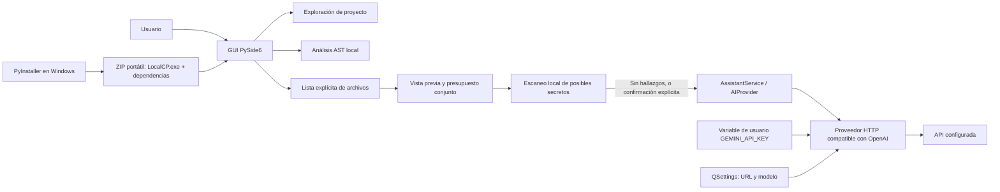

# Arquitectura

## Objetivo

Local CP explora y analiza proyectos localmente. La asistencia de IA es optativa:
el usuario agrega archivos, revisa el contexto y pulsa **Send** para enviarlo.
Abrir un proyecto o ejecutar análisis estático no inicia solicitudes externas.

## Componentes

- `gui`: interfaz PySide6, selección, vista previa y tareas en `QThreadPool`.
- `project`: exploración, clasificación y lectura de archivos de texto.
- `analysis`: análisis determinista de Python mediante `ast`.
- `ai.context`: lista explícita de archivos y presupuesto conjunto de entrada.
- `ai.secret_scan`: heurísticas locales que devuelven ubicación y tipo, sin valores.
- `ai.provider`: contrato `AIProvider` consumible por otros proveedores.
- `ai.service`: construye el proveedor seleccionado y resuelve la credencial.
- `ai.openai_compatible`: transporte HTTP de Chat Completions.
- `config`: preferencias no secretas y lectura de `GEMINI_API_KEY` desde Windows.
- `scripts`: construcción del paquete portátil y verificación del ZIP extraído.

```mermaid
flowchart LR
    U[Usuario] --> G[GUI PySide6]
    G --> P[Exploración de proyecto]
    G --> A[Análisis AST local]
    G --> L[Lista explícita de archivos]
    L --> C[Vista previa y presupuesto conjunto]
    C --> D[Escaneo local de posibles secretos]
    D -->|Sin hallazgos, o confirmación explícita| S[AssistantService / AIProvider]
    S --> H[Proveedor HTTP compatible con OpenAI]
    H --> E[API configurada]
    W[Variable de usuario GEMINI_API_KEY] --> H
    Q[QSettings: URL y modelo] --> H
    B[PyInstaller en Windows] --> Z[ZIP portátil: LocalCP.exe + dependencias]
    Z --> G
```

El diagrama representa el flujo actual y es la base para próximas iteraciones.
`project`, `analysis` y `ai` no dependen de Qt. El modelo y la URL son campos
editables; el transporte puede reemplazarse implementando `AIProvider`.

## Alcance y límites del prototipo de IA

- Entre uno y tres archivos `.py` agregados manualmente desde el proyecto abierto.
  Se rechazan duplicados, enlaces simbólicos y archivos externos.
- Máximo 12.000 bytes de fuente **entre todos los archivos**, 1.000 caracteres de
  pregunta y estimación de 4.000 tokens de entrada. La estimación usa bytes UTF-8
  divididos por 3 más margen; no es un tokenizador exacto.
- Máximo 384 tokens de salida solicitados al proveedor.
- Cada archivo se lee al preparar la vista previa y se conserva esa copia para el
  envío. Cambiar la lista o la pregunta invalida la vista previa. La selección
  del árbol por sí sola no agrega contexto.
- El escaneo de I4 usa esa misma copia y la pregunta. Sólo identifica algunos
  formatos evidentes de claves, encabezados de clave privada y literales asignados
  a nombres como `api_key` o `password`. Puede producir falsos positivos y omitir
  secretos de otros formatos; el usuario sigue revisando el contenido completo.
- Si hay hallazgos, una casilla de confirmación adicional habilita Send para esa
  vista previa. Cambiar pregunta o lista borra esa confirmación.
- La clave se lee en tiempo de ejecución del entorno del proceso o de la variable
  de usuario de Windows. No se guarda en `QSettings` ni en el repositorio.
- Errores HTTP muestran sólo código y categoría; no imprimen cuerpos de respuesta,
  encabezados, solicitudes ni claves.
- Una solicitud a la vez desde la pestaña AI. No hay reintentos automáticos.

## Concurrencia

Escaneo y análisis AST usan `QThreadPool`; la solicitud HTTP también. Los resultados
vuelven a la interfaz por señales Qt, conservando la ventana interactiva.

## Decisiones y límites conocidos

- El análisis estructural sigue siendo exclusivo de Python.
- La detección de lenguajes depende de extensiones.
- La vista de código no edita ni colorea sintaxis.
- Los directorios ignorados usan una lista fija, no `.gitignore`.
- I5 genera un ZIP portátil para Windows 11 de la misma arquitectura que la
  máquina de compilación. No es un instalador ni está firmado; se debe conservar
  toda la carpeta `LocalCP` junto al EXE.
- La prueba automática extrae el ZIP a otra carpeta y ejecuta un arranque Qt
  offscreen sin Python en `PATH`. El usuario confirmó la revisión visual; queda
  pendiente una prueba en otra máquina.
- No hay lockfile; los rangos de dependencias no producen builds idénticos a
  nivel de bytes. Ver [guía de empaquetado](packaging.md).
- La estimación de tokens es aproximada y la cuota real depende del proyecto de
  Google AI Studio. No se infiere una cuota gratis fija.
- El endpoint compatible con OpenAI está en beta según [Google AI for Developers](https://ai.google.dev/gemini-api/docs/openai).

## Evolución prevista

Ver [SPEC.md](SPEC.md). Una próxima iteración puede sumar conteo más preciso por
proveedor, cancelación, conversaciones locales y otros transportes sin tocar el
análisis estático.
